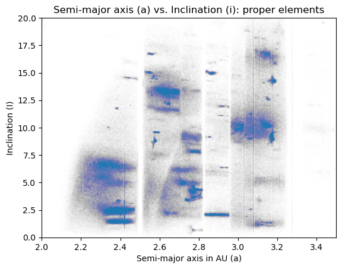
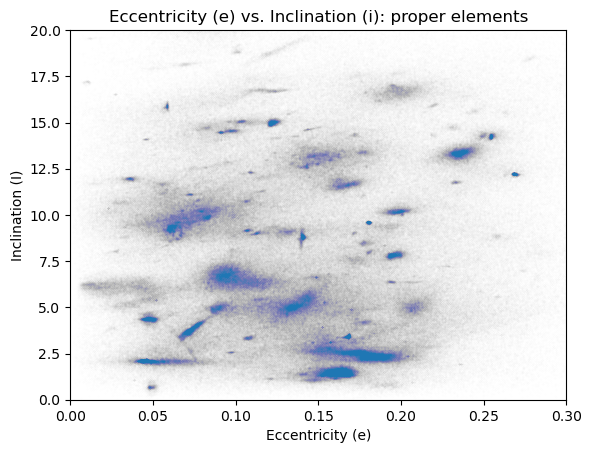
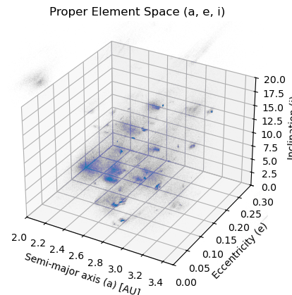

# Python Project Template Repository

This repository holds the code for the second project in ENGR3560: Scientific Computing. The goal is to reach a 95% accuracy rate 

This project compares the results from two different clustering algorithms: K-means and heirarchical.
- include the original reference paper and the screenshot in the notes document
Link to original dataset: https://newton.spacedys.com/astdys2/index.php?pc=5


## To-do:
- fill out README
- currently data must be downloaded manually, and then the paths need to be changed in the txt_csv_converter.py file -> add 'requests' package here to automate this process


## Key Simulation Variables
a, e, i -> sin(i) in the data, but turned into i

### Visual Exploration of Asteroid Data
<table>
  <tr>
    <td align="center">
      <br>
      Semi-major axis (AU) vs. Inclination (°)
    </td>
    <td align="center">
      <br>
      Eccentricity vs. Inclination (°)
    </td>
    <td align="center">
      <br>
      3D representation of clusters (a, e, i)
    </td>
  </tr>
</table>

The 2D and 3D representations show the clusters that appear in the asteroid data when looking at constrainted a, e, and i parameters.

## Usage Examples & Benchmarks

## Requirements

The `requirements.txt` file is blank and should be filled out with any project
dependencies. There is a Python package called `pipreqs` that autogenerates the
contents of the `requirements.txt` file based on the `import` statements in your
`.py` files. To get this, run

```
pip install pipreqs
```

Then, in the root of your project repository, run:

```
pipreqs --mode compat
```

If you already have a `requirements.txt`, the above command will ask you to
rerun the command with the `--force` flag to overwrite it.

## How to Use

-> data file is too big to upload to github
--> need to include directions for how to download the data from the website and probably have a script to run to turn it into an excel spreadsheet?

Click on the "Use this template" button in the top right corner to create a new
repository based on this template. If this is for a class project, we ask that
you keep it in the `olincollege` GitHub organization, and that you refrain from
keeping the repository private. This will ensure that relevant people can access
your repository for assessment, etc.

## File Structure

## Author
The creator of this repository is Alex Mineeva (amineeva).

## Sources